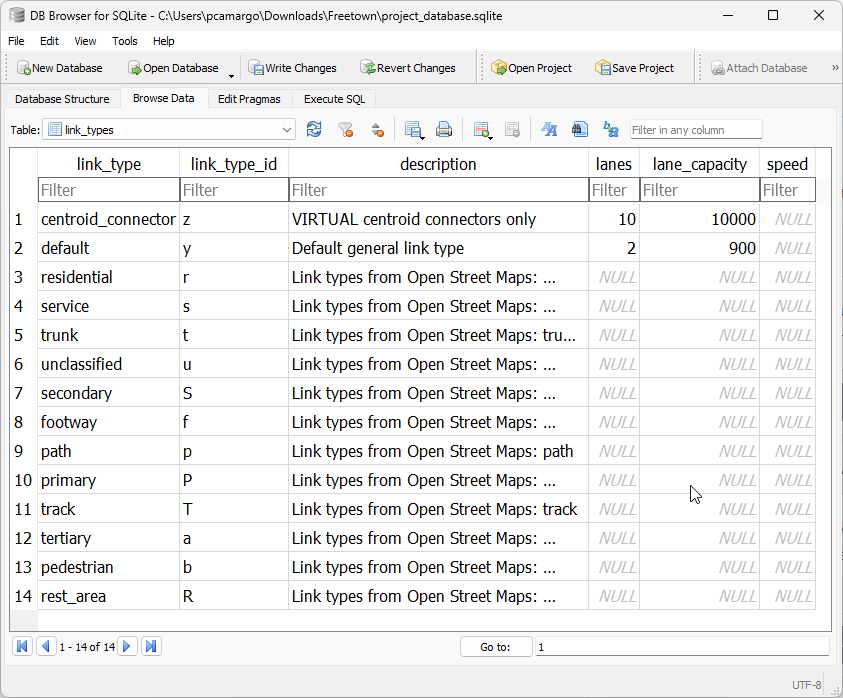
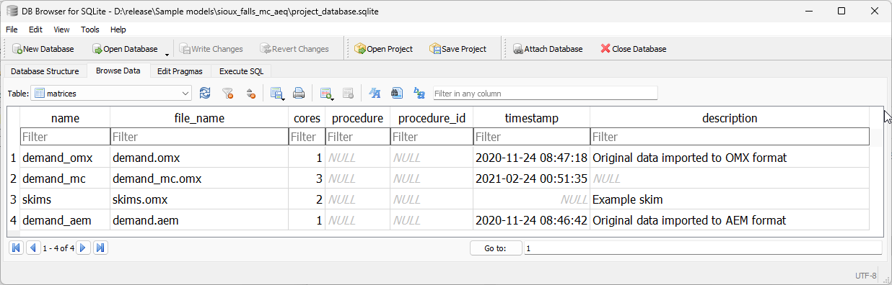
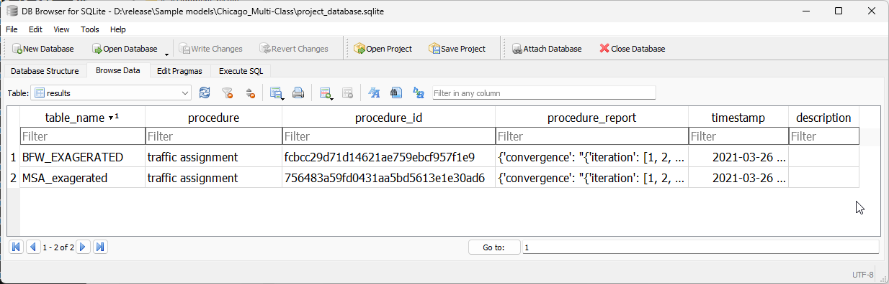
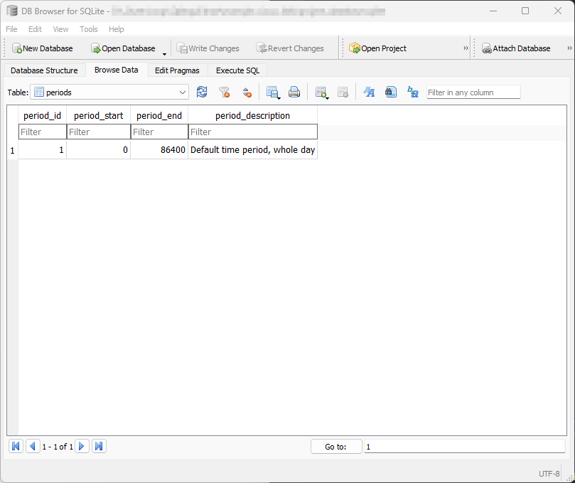

Project database
----------------

In this section we discuss on a nearly per-table basis the role of each table for an
AequilibraE model. In the end, a more technical view of the :ref:`database structure <supply_data_model>`, 
including the SQL queries used to create each table and the indices used for each table are also available.

.. _network:

Network
~~~~~~~

The objectives of developing a network format for AequilibraE are to provide the
users a seamless integration between network data and transportation modeling
algorithms and to allow users to easily edit such networks in any GIS platform
they'd like, while ensuring consistency between network components, namely links
and nodes. As the network is composed by two tables, **links** and **nodes**,
maintaining this consistency is not a trivial task.

As mentioned in other sections of this documentation, the links and a nodes
layers are kept consistent with each other through the use of database triggers,
and the network can therefore be edited in any GIS platform or
programmatically in any fashion, as these triggers will ensure that
the two layers are kept compatible with each other by either making
other changes to the layers or preventing the changes.

**We cannot stress enough how impactful this set of spatial triggers was to**
**the transportation modeling practice, as this is the first time a**
**transportation network can be edited without specialized software that**
**requires the editing to be done inside such software.**

.. important::
   AequilibraE does not currently support turn penalties and/or bans. Their
   implementation requires a complete overahaul of the path-building code, so
   that is still a long-term goal, barred specific development efforts.

.. seealso::

   * :ref:`links_network_data_model`
      Data model
   * :ref:`nodes_network_data_model`
      Data model

.. _tables_modes:

Modes table
~~~~~~~~~~~

The **modes** table exists to list all the modes available in the model's network,
and its main role is to support the creation of graphs directly from the SQLite
project.

.. important::

    Modes must have a unique mode_id composed of a single letter, which is
    case-sensitive to a total of 52 possible modes in the model.

As described in the SQL data model, all AequilibraE models are created with 4
standard modes, which can be added to or removed by the user, and would look like
the following.

.. image:: ../_images/modes_table.png
    :align: center
    :alt: Modes table structure

Consistency triggers
^^^^^^^^^^^^^^^^^^^^

As it happens with the links and nodes tables, the modes table is kept consistent with the 
links table through the use of database triggers.

.. _changing_modes_for_link:

Changing the modes allowed in a certain link
++++++++++++++++++++++++++++++++++++++++++++

Whenever we change the modes allowed on a link, we need to check for two
conditions:

* At least one mode is allowed on that link
* All modes allowed on that link exist in the modes table

For each condition, a specific trigger was built, and if any of the checks
fails, the transaction will fail.

Having successfully changed the modes allowed in a link, we need to
update the modes that are accessible to each of the nodes which are the
extremities of this link. For this purpose, a further trigger is created
to update the modes field in the nodes table for both of the link's a_node and
b_node.

Directly changing the modes field in the nodes table
++++++++++++++++++++++++++++++++++++++++++++++++++++

A trigger guarantees that the value being inserted in the field is according to
the values found in the associated links' modes field. If the user attempts to
overwrite this value, it will automatically be set back to the appropriate value.

Adding a new link
+++++++++++++++++

The exact same behaviour as for :ref:`changing_modes_for_link` applies in this
case, but it requires specific new triggers on the **creation** of the link.

.. _editing_mode:

Editing a mode in the modes table
+++++++++++++++++++++++++++++++++

Whenever we want to edit a mode in the modes table, we need to check for two
conditions:

* The new mode_id is exactly one character long
* The old mode_id is not still in use on the network

For each condition, a specific trigger was built, and if any of the checks
fails, the transaction will fail.

The requirements for uniqueness and non-absent values are guaranteed during the
construction of the modes table by using the keys **UNIQUE** and **NOT NULL**.

.. _adding_new_mode:

Adding a new mode to the modes table
++++++++++++++++++++++++++++++++++++

In this case, only the first behaviour mentioned above on
:ref:`editing_mode` applies, the verification that the mode_id is
exactly one character long. Therefore only one new trigger is required.

.. _deleting_a_mode:

Removing a mode from the modes table
++++++++++++++++++++++++++++++++++++

In counterpoint, only the second behaviour mentioned above on
:ref:`editing_mode` applies in this case, the verification that the old
'mode_id' is not still in use by the network. Therefore only one new trigger is
required.

.. seealso::

    * :func:`aequilibrae.project.network.Modes`
        Class documentation
    * :ref:`modes_network_data_model`
        Data model

.. _tables_link_types:

Link types table
~~~~~~~~~~~~~~~~

The **link_types** table exists to list all the link types available in the
model's network, and its main role is to support processes such as adding
centroids and centroid connectors, and to store reference data like default
lane capacity for each link type.

.. _reserved_values:

Reserved values
^^^^^^^^^^^^^^^

There are two default link types in the link_types table and that cannot be
removed from the model without breaking it.

- **centroid_connector** - These are **VIRTUAL** links added to the network with
  the sole purpose of loading demand/traffic onto the network. The identifying
  letter for this mode is **z**.

- **default** - This link type exists to facilitate the creation of networks
  when link types are irrelevant. The identifying letter for this mode is **y**.
  That is right, you have from **a** to **x** to create your own link types, as well
  as all upper-case letters of the alphabet.

.. _adding_new_link_types:

Adding new link types to a project
^^^^^^^^^^^^^^^^^^^^^^^^^^^^^^^^^^

Adding link types to a project can be done through the Python API or directly into
the 'link_types' table, which could look like the following.

.. note::

    Both 'link_type' and 'link_type_id' MUST be unique

.. _consistency_triggers:

Consistency triggers
^^^^^^^^^^^^^^^^^^^^

As it happens with the links and nodes tables, the 'link_types' table is kept consistent
with the links table through the use of database triggers.

.. _change_reserved_types:

Changes to reserved link_types
++++++++++++++++++++++++++++++

For both link types mentioned about (**y** & **z**), changes to the 'link_type'
and 'link_type_id' fields, as well as the removal of any of these records are
blocked by database triggers, as to ensure that there is always one generic
physical link type and one virtual link type present in the model.

.. _change_link_type_for_link:

Changing the link type for a certain link
+++++++++++++++++++++++++++++++++++++++++

Whenever we change the 'link_type' associated to a link, we need to check whether
that link type exists in the links_table.

This condition is ensured by specific trigger checking whether the new 'link_type' 
exists in the link table. If if it does not, the transaction will fail.

We also need to update the 'link_types' field the nodes connected to the link
with a new string of all the different 'link_type_id's connected to them.

.. _adding_new_link:

Adding a new link
+++++++++++++++++

The exact same behaviour as for :ref:`change_link_type_for_link` applies in this
case, but it requires an specific trigger on the **creation** of the link.

.. _editing_lt_on_lt_table:

Editing a link type in the *link_types* table
+++++++++++++++++++++++++++++++++++++++++++++

Whenever we want to edit a 'link_type' in the 'link_types' table, we need to check
for two conditions:

* The new 'link_type_id' is exactly one character long
* The old 'link_type' is not in use on the network

For each condition, a specific trigger was built, and if any of the checks
fails, the transaction will fail.

The requirements for uniqueness and non-absent values are guaranteed during the
construction of the 'link_types' table by using the keys **UNIQUE** and
**NOT NULL**.

.. _adding_new_ltype:

Adding a new link type to the *link_types* table
++++++++++++++++++++++++++++++++++++++++++++++++

In this case, only the first behaviour mentioned above on
:ref:`editing_lt_on_lt_table` applies, the verification that the 'link_type_id' is
exactly one character long. Therefore only one new trigger is required.

.. _deleting_ltype:

Removing a link type from the *link_types* table
++++++++++++++++++++++++++++++++++++++++++++++++

In counterpoint, only the second behaviour mentioned above on
:ref:`editing_lt_on_lt_table` applies in this case, the verification that the old
'link_type' is not still in use by the network. Therefore only one new trigger is
required.

.. seealso::

    * :func:`aequilibrae.project.network.LinkTypes`
       Class documentation
    * :ref:`link_types_network_data_model`
        Data model

.. _tables_zones:

Zones table
~~~~~~~~~~~

The default **zones** table has a **MultiPolygon** geometry type and a limited
number of fields, as most of the data is expected to be in the
**demand_database.sqlite**.

The API for manipulation of the zones table and each one of its records is
consistent with what exists to manipulate the other fields in the database.

As it happens with links and nodes, zones also have geometries associated with
them, and in this case they are of the type .

You can check :ref:`this example <create_zones>` to learn how to add zones to your project.

.. seealso::

    * :func:`aequilibrae.project.Zone`
        Class documentation
    * :ref:`zones_network_data_model`
        Data model

.. _matrix_table:

Matrices table
~~~~~~~~~~~~~~

The **matrices** table in the project_database is nothing more than an index of
all matrix files contained in the matrices folder inside the AequilibraE project.

This index, which looks like below, has two main columns. The first one is the
**file_name**, which contains the actual file name in disk as to allow
AequilibraE to find the file, and **name**, which is the name by which the user
should refer to the matrix in order to access it through the API.

As AequilibraE is fully compatible with OMX, the index can have a mix of matrix
types (AEM and OMX) without prejudice to functionality.

.. seealso::

    * :func:`aequilibrae.project.Matrices`
        Class documentation
    * :ref:`matrices_network_data_model`
        Data model

.. _tables_about:

About table
~~~~~~~~~~~

The **about** table is the simplest of all tables in the AequilibraE project,
but it is the one table that contains the documentation about the project, and 
it is therefore crucial for project management and quality assurance during
modeling projects.

It is possible to create new information fields programmatically. Once
the new field is added, the underlying database is altered and the field will
be present when the project is open during future use.

This table, which can look something like the example from image below, is required
to exist in AequilibraE but it is not currently actively used by any process.
We strongly recommend not to edit the information on **projection** and
**aequilibrae_version**, as these are fields that might or might not be used by
the software to produce valuable information to the user with regards to
opportunities for version upgrades.

.. image:: ../_images/about_table_example.png
    :alt: About table structure
    :align: center

.. seealso::

    * :func:`aequilibrae.project.About`
        Class documentation
    * :ref:`about_network_data_model`
        Data model

.. _parameters_metadata:

Project attributes
~~~~~~~~~~~~~~~~~~

Documentation is paramount for any successful modeling project. For this reason,
AequilibraE has a database table dedicated to the documentation of each field in
each of the other tables in the project. This table, called
**attributes_documentation** can be accessed directly through SQL, but it is
envisaged that its editing and consultation would happen through the Python API
itself.

As a simple table, it looks as follows:

.. image:: ../_images/attributes_documentation.png
    :align: center
    :alt: attributes documentation table 

.. seealso::

    * :ref:`attributes_documentation_network_data_model`
        Data model

.. _tables_results:

Results table
~~~~~~~~~~~~~

The **results** table exists to hold the metadata for the results stored in the
**results_database.sqlite** in the same folder as the model database. In that,
the 'table_name' field is unique and must match exactly the table name in the
**results_database.sqlite**.

Although those results could as be stored in the model database, it is possible
that the number of tables in the model file would grow too quickly and would
essentially clutter the **project_database.sqlite**.

As a simple table, it looks as follows:

.. seealso::
    * :ref:`results_network_data_model`
        Data model

.. _tables_period:

Periods table
~~~~~~~~~~~~~
    

.. seealso::

    * :func:`aequilibrae.project.network.Periods`
        Class documentation
    * :ref:`periods_network_data_model`
        Data model
