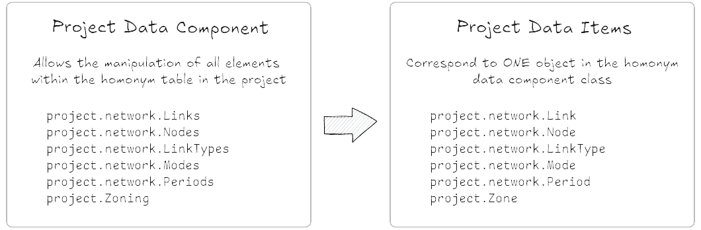

Project Data Components
=======================

In the :ref:`aeq_project_structure` section, we present the structure of an AequilibraE project:
databases, folders, and parameters. In this section, we present the data components of the project,
that is, the data that is presented in the databases.

The components of an AequilibraE project are:

* ``project.About``
* ``project.FieldEditor``
* ``project.Log``
* ``project.Matrices``
* ``project.Network``
* ``project.Zoning``

Network and Zoning are the components that contain the geo-spatial information of the project, such
as links, nodes, and zones, which can also be manipulated. In the Network component, there are also
non-geometric classes related to the project network, such as Modes, LinkTypes, and Periods.

One important thing to observe is that related to each component in Matrices, Network, and Zoning, 
there is an object with similar name that corresponds to one object in the class. 
Thus ``project.network.links`` enables the access to manipulate the 'links' table, and each item in 
the items table is a ``Link`` object.

.. toctree::
    :caption: Project Data Components
    :maxdepth: 1

    project_components/components
    project_components/aequilibrae_matrix
